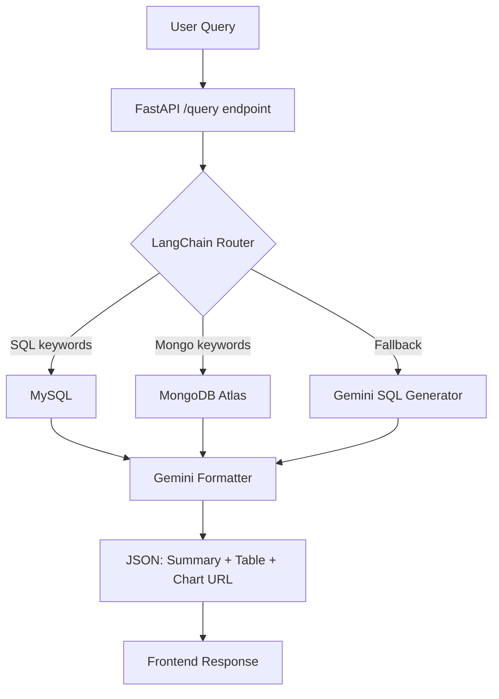

# 💼 Wealth Assistant — Natural Language Financial Data Query System

## 🚀 Overview

Wealth Assistant is an AI-powered, full-stack platform that allows users to ask natural language questions over multiple databases (MySQL & MongoDB) and receive structured financial insights with summaries, tables, and graphs.

Designed for **relationship managers handling high-net-worth individuals** (film stars, athletes, etc.), it turns complex, scattered financial data into easy-to-understand visual stories.

---

## 🧠 Core Technologies

| Layer        | Tech Stack                                        |
| ------------ | ------------------------------------------------- |
| Frontend     | React.js (Vite), Recharts, TailwindCSS            |
| Backend      | FastAPI (Python), LangChain, LangGraph            |
| LLM          | Gemini 3.5 Flash (`gemini-3.5-flash`), LangChain  |
| Databases    | MySQL 8.0, MongoDB Atlas                          |
| Graph API    | QuickChart.io                                     |
| Storage      | LocalStorage (for frontend query history)         |
| Voice Input  | Web Speech API                                    |

---

## 🌐 Live Features

### 🔍 Natural Language Query (NLQ)

Users can ask questions like:

* `"Top 5 clients by portfolio value"`
* `"Which clients hold Infosys stock?"`
* `"Who manages the highest portfolio?"`
* `"Clients with high risk appetite"`
* `"Clients from Mumbai"`

✨ Gemini generates:

* A financial **summary**
* A structured **table**
* A relevant **graph** (bar, pie, line, doughnut)

---

### 📊 Insights Dashboard

Navigate to `/insights` to view:

* 🔹 **Historical Charts** — Top clients & top stocks by portfolio value
* 🔸 **LLM-based Charts** — AI-generated insights from Gemini (cached to minimize API calls)

---

### 🗣️ Voice Search

Press the mic icon and speak your query.

* Converts voice to text via Web Speech API
* Sends to the backend just like typed input

---

### 📚 Query History

Visit `/history`:

* Stores every query + response (summary + table + graph) locally
* Fully frontend-driven using LocalStorage
* Click any entry to open a modal and review past results

---

## 🧱 Backend Architecture



### Key Endpoints

* `POST /query` — Handles natural language input → routes to DB → formats with Gemini → returns JSON
* `GET /insights` — Returns historical MySQL charts + Gemini-generated LLM charts (cached)

---

## 🧩 LangChain Usage

* **LangChain Router** — Rule-based keyword routing: SQL vs Mongo vs Gemini fallback
* **LangChain Components:**
  * `ChatGoogleGenerativeAI` for Gemini LLM calls
  * Custom chains for SQL generation & response formatting
  * Fallback agent for queries not matched by rules

---

## 📁 File Structure

```
AI_Wealth_Management/
├── backend/
│   ├── main.py                   # FastAPI app, /query and /insights endpoints
│   ├── data.py                   # Original MongoDB seed script (legacy)
│   ├── seed_mongo.py             # Full MongoDB seed script (30 clients, C001–C030)
│   ├── cached_insights.json      # Cache file for LLM-generated insights
│   ├── .env.example              # Template for environment variables
│   ├── chains/
│   │   ├── query_router.py       # Routes query to MySQL or MongoDB
│   │   ├── sql_generator.py      # Generates SQL from natural language via Gemini
│   │   ├── response_formatter.py # Formats DB results into JSON via Gemini
│   │   ├── mysql_query.py        # Predefined MySQL query handlers
│   │   └── mongo_query.py        # Predefined MongoDB query handlers
│   ├── db/
│   │   ├── mysql_handler.py      # MySQL connection
│   │   └── mongo_handler.py      # MongoDB connection
│   └── utils/
│       └── sql_runner.py         # Executes SQL + serializes Decimal/date types
│
├── frontend/
│   ├── src/
│   │   ├── components/
│   │   │   ├── Navbar.jsx
│   │   │   ├── Layout.jsx
│   │   │   ├── HistoryModal.jsx
│   │   │   ├── QueryForm.jsx
│   │   │   └── ResultCard.jsx
│   │   ├── pages/
│   │   │   ├── Home.jsx
│   │   │   ├── History.jsx
│   │   │   └── InsightsPage.jsx
│   │   ├── App.jsx
│   │   └── api.js
│   ├── .env.example              # Template for frontend environment variables
│   └── package.json
│
├── .gitignore
├── requirements.txt
└── README.md
```

---

## 🧪 Sample Queries

```
# MySQL-based (financial/transaction data)
"Top 5 clients by portfolio value"
"Which clients hold Infosys stock?"
"Who manages the highest portfolio?"
"Transaction history for C001"
"Which clients have the most diversified portfolio?"

# MongoDB-based (client profiles)
"Clients with high risk appetite"
"Clients from Mumbai"
"Who prefers investing in Gold?"
"Clients who invest in Crypto"
"Clients with low risk appetite"
```

---

## 🏦 Database Setup

### 🧮 MySQL

Run the following SQL to create the required database and tables:

```sql
CREATE DATABASE IF NOT EXISTS portfolio_db;
USE portfolio_db;

CREATE TABLE transactions (
  id INT AUTO_INCREMENT PRIMARY KEY,
  client_id VARCHAR(100),
  stock_name VARCHAR(100),
  value DECIMAL(12,2),
  date DATE
);

CREATE TABLE relationship_managers (
  client_id VARCHAR(100),
  manager_name VARCHAR(100),
  PRIMARY KEY(client_id)
);
```

### 🍃 MongoDB

* Create a free cluster on [MongoDB Atlas](https://www.mongodb.com/cloud/atlas)
* Add your connection URI to `backend/.env` (see setup below)
* Run the seed script to populate the `clients` collection:

```bash
cd backend
python seed_mongo.py
```

Example client document:

```json
{
  "client_id": "C001",
  "name": "Arjun Kapoor",
  "address": "Mumbai",
  "risk_appetite": "high",
  "investment_preferences": ["Equity", "Stocks"],
  "relationship_manager": "Ashima Sharma"
}
```

---

## ⚙️ Prerequisites

Before running the project, make sure you have:

| Tool | Version | Notes |
|------|---------|-------|
| Python | 3.10+ | [Download](https://www.python.org/downloads/) |
| Node.js | 18+ | [Download](https://nodejs.org/) |
| MySQL | 8.0+ | Must be running locally |
| MongoDB Atlas | Free tier | [Sign up](https://www.mongodb.com/cloud/atlas) |
| Google Gemini API Key | — | [Get free key](https://aistudio.google.com/app/apikey) |

> ⚠️ **Gemini Free Tier Limit:** The free tier allows **5 requests per minute** per model. Space queries at least 12 seconds apart. To remove this limit, enable billing on your Google AI account.

---

## 🚀 Getting Started

### 1️⃣ Clone the Repository

```bash
git clone https://github.com/Anmol954/AI_Wealth_Management.git
cd AI_Wealth_Management
```

### 2️⃣ Backend Setup

```bash
cd backend

# Create and activate virtual environment
python -m venv venv

# On Command Prompt:
venv\Scripts\activate

# On PowerShell:
.\venv\Scripts\Activate.ps1

# Install dependencies
pip install -r requirements.txt
```

**Create your `.env` file** (copy from template):

```bash
copy .env.example .env
```

Then fill in your values in `backend/.env`:

```env
GOOGLE_API_KEY=your_google_gemini_api_key
MYSQL_HOST=localhost
MYSQL_USER=root
MYSQL_PASSWORD=your_mysql_password
MYSQL_DATABASE=portfolio_db
MONGO_URI=mongodb+srv://<user>:<password>@cluster0.xxxxx.mongodb.net/portfolio-db?retryWrites=true&w=majority&appName=Cluster0
```

> ⚠️ If your MongoDB password contains special characters (e.g. `@`, `#`), URL-encode them. For example, `@` → `%40`.

**Create MySQL tables** (run once):

```bash
mysql -u root -p portfolio_db < ../schema.sql
```

Or paste the SQL from the [Database Setup](#-database-setup) section above into your MySQL client.

**Seed MongoDB data** (run once):

```bash
python seed_mongo.py
```

**Start the backend server:**

```bash
python main.py
```

Backend will be live at: `http://localhost:8000`

---

### 3️⃣ Frontend Setup

```bash
cd frontend

# Install dependencies
npm install

# Create your .env file
copy .env.example .env
```

The `frontend/.env` file should contain:

```env
VITE_API_URL=http://localhost:8000
```

**Start the frontend dev server:**

```bash
npm run dev
```

Frontend will be live at: `http://localhost:5173`

---

## 💡 Future Enhancements

| Feature                    | Description                                               |
| -------------------------- | --------------------------------------------------------- |
| ✨ Model Context Protocol   | Use LangChain's MCP to support persistent multi-turn chat |
| 🔐 Auth & Role Access      | Secure dashboard by user types (client, manager)          |
| 📈 Real-time Market Data   | Integrate with stock APIs for live portfolio updates      |
| 📄 PDF Upload + Parsing    | Extract and ingest documents for context in RAG           |
| 📤 Export Insights         | Save insights as PDF or CSV                               |
| 📱 Mobile App Integration  | Build companion app using React Native                    |
| 🔄 WebSocket Live Updates  | Real-time query results via WebSocket                     |

---

## 🙋 Why This Project Stands Out

* ✅ Gemini 3.5 Flash + LangChain for intelligent NLQ
* ✅ Dual-database support: SQL & NoSQL with smart routing
* ✅ AI-generated chart suggestions with QuickChart.io
* ✅ Modern React UI with voice search & query history
* ✅ Retry logic for graceful Gemini rate-limit handling
* ✅ Fully modular and extensible architecture

---

## 📬 Contact

Feel free to reach out if you want to collaborate, extend this project, or hire me for an AI-driven initiative.

**Built with ❤️ by Anmol Madhav**

---
